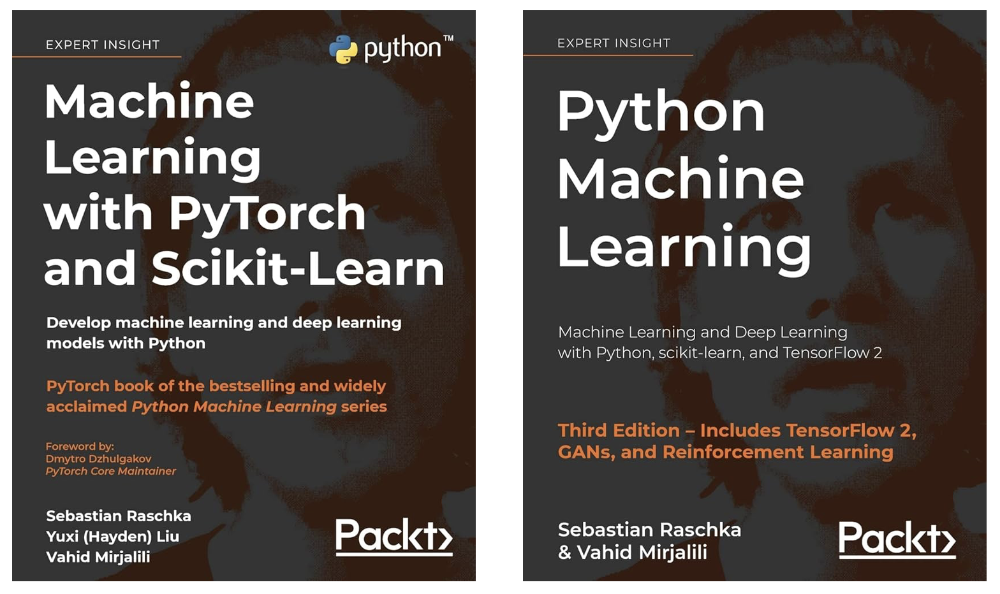
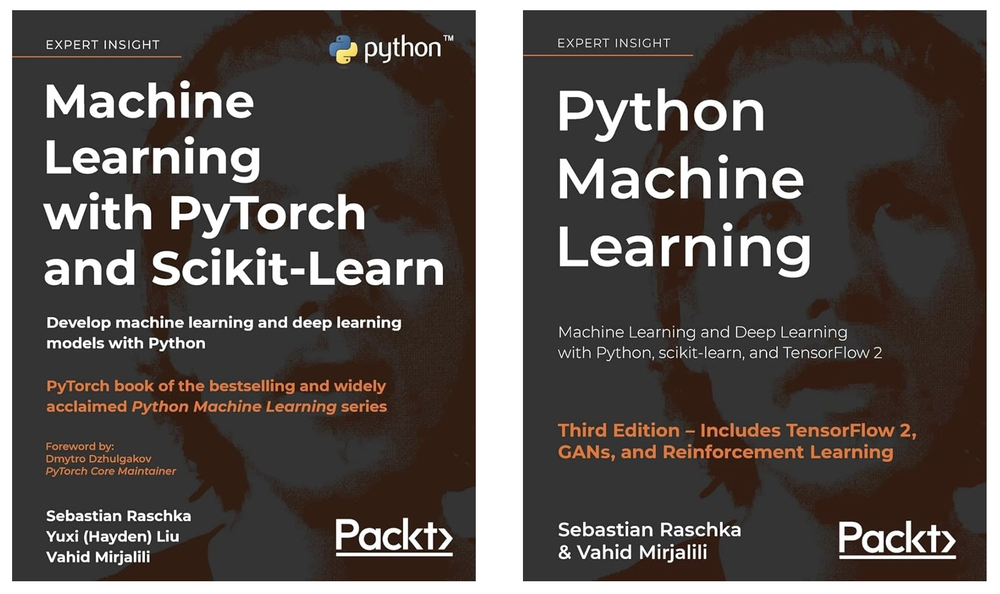

## Hi, I’m Vahid Mirjalili 👋

I’m a Machine Learning Research Scientist with expertise in building and fine-tuning large language models (LLMs), multi-modal models, and deep learning systems. With a strong background in **Computer Vision**, **Natural Language Processing**, and building **Multimodal Language and Vision models**, I’m passionate about creating innovative solutions to solve real-world problems.

### 🎥 Check out my YouTube Channel
I regularly post tutorials and deep dives into machine learning topics on my [YouTube channel](https://www.youtube.com/channel/UCquhhue4JeJv_2dXXpib48Q).

### 📚 Books
I have authored several books on machine learning, including **"Python Machine Learning"** and **"Machine Learning with PyTorch and scikit-learn"**, and I’m currently working on **"Grokking Transformers"**, which is being published by Manning.

<!---->

### 🎓 Courses
I also teach courses to help others get started in machine learning and computer vision. Check out my Udemy course **"Applied Computer Vision: Object Detection and Recognition"**:

- [Applied Computer Vision: Object Detection and Recognition](https://www.udemy.com/course/applied-computer-vision)

### 🌱 Stay Connected
- 🧑🏻‍💻 Twitter [(@vmirly)](https://twitter.com/vmirly)
- 🖇️  [LinkedIn/vahid-mirjalili](https://www.linkedin.com/in/vahid-mirjalili/)

You can find all my other work and social links here: [linktr.ee/vmirly](https://linktr.ee/vmirly).

